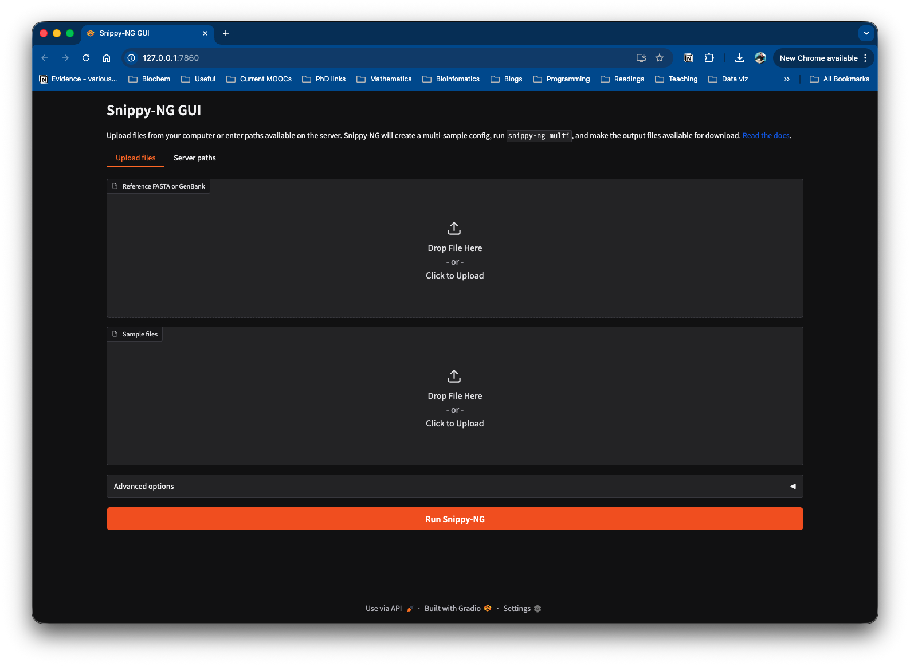

# `snippy-ng gui`

[](https://colab.research.google.com/drive/144z09rUrX5ZP_UWHx39G6fOckPvFMKnf?usp=sharing)

Launch the optional Gradio graphical interface for running `snippy-ng multi`
from a browser.

The GUI accepts a reference genome and sample files, creates a multi-sample
configuration, runs the multi-sample pipeline, and provides output files for
download.



## Install

The GUI depends on Gradio, which is optional. Install Snippy-NG with the GUI
extra:

```console
pip install 'snippy-nextgen[gui]'
```

Or add Gradio to an existing Snippy-NG environment:

```console
pip install gradio
```

## Quick Start

Run the GUI locally:

```console
snippy-ng gui
```

By default this starts a server on `127.0.0.1:7860` and opens the interface in
your browser.

Use a different host or port:

```console
snippy-ng gui --host 0.0.0.0 --port 7861
```

Do not open a browser automatically:

```console
snippy-ng gui --no-browser
```

## Public Hosting

If you are hosting the GUI for other users, you should usually run it with both
`--temp-output` and `--no-server-paths`:

```console
snippy-ng gui --host 0.0.0.0 --temp-output --no-server-paths
```

`--temp-output` writes each GUI run under the Gradio/system temporary directory
instead of the current working directory. This avoids filling the launch
directory with user run outputs.

`--no-server-paths` hides the server-side path inputs and allows uploads only.
This prevents users from entering arbitrary paths on the host running the GUI.

You can also ask Gradio to create a public share link:

```console
snippy-ng gui --share --temp-output --no-server-paths
```

Only use `--share` when you are comfortable exposing the running GUI through
Gradio's sharing service.

## Inputs

By default the GUI supports two input modes:

- Upload files from your computer.
- Enter paths that already exist on the server.

Use `--no-server-paths` to disable server path entry:

```console
snippy-ng gui --no-server-paths
```

This is the safer mode for public or shared deployments.

## Outputs

After a run completes, the GUI shows the output directory and a file browser for
downloading individual output files.

The GUI also includes a button to create a `.tar.gz` archive of the output
directory on demand. The archive is created in a temporary directory when the
button is clicked, not during the pipeline run.

By default, run output directories are created under the current working
directory. Use `--temp-output` to place them under the Gradio/system temporary
directory instead:

```console
snippy-ng gui --temp-output
```

## Resource Limits

Use `--max-cpus` to cap the highest CPU value available in the GUI:

```console
snippy-ng gui --max-cpus 16
```

This is useful on shared machines where you do not want GUI users to request all
available cores.

## Command Options

| Option | Default | Purpose |
| --- | --- | --- |
| `--host` | `127.0.0.1` | Host interface for the GUI server. |
| `--port` | `7860` | Port for the GUI server. |
| `--share` | disabled | Create a public Gradio share link. |
| `--no-browser` | disabled | Do not open the GUI in a browser. |
| `--temp-output` | disabled | Write GUI run outputs under the Gradio/system temp directory. |
| `--max-cpus` | detected CPUs | Maximum CPU value allowed in the GUI. |
| `--no-server-paths` | disabled | Hide server-side path inputs and allow uploads only. |
