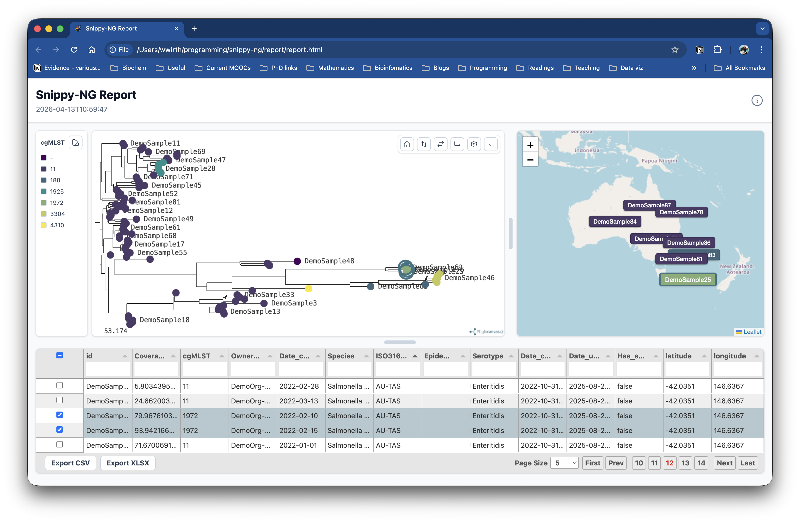

# `snippy-ng utils report-tree`

Create a standalone HTML report from a phylogenetic tree.

The report renders an interactive tree and can include sample metadata, run logs,
and a custom title. It is useful after running `snippy-ng multi` and
`snippy-ng tree`, or any time you already have a Newick tree that you want to
inspect in a browser.



## Example Report

[Here is an example report](report.html) generated from the Snippy-NG.

<iframe
  src="report.html"
  title="Example Snippy-NG report"
  loading="lazy"
  style="width: 100%; min-height: 760px; border: 1px solid var(--md-default-fg-color--lightest); border-radius: 8px;"
></iframe>

## Quick Start

```console
snippy-ng utils report-tree multi/tree/tree.treefile \
  --metadata multi/snippy.vcf.summary.tsv
```

This writes the HTML report to:

```text
report/report.html
```

Open the HTML file in a web browser to view the interactive report.

## Inputs

The only required input is a Newick tree.

```console
snippy-ng utils report-tree tree.newick
```

Metadata is optional, but recommended when you want to label, search, filter, or
colour tree tips by sample fields.

```console
snippy-ng utils report-tree tree.newick --metadata metadata.csv
```

Supported metadata formats are:

- CSV
- TSV
- JSON

Metadata rows must include one of these sample identifier columns:

- `id`
- `sample_id`
- `sample`
- `name`

The identifier values must match tip names in the Newick tree. Rows that do not
match tree tips are skipped.

## Colour Tips By Metadata

Use `--color-by-column` to choose a metadata column for the initial tree colour
scheme.

```console
snippy-ng utils report-tree tree.newick \
  --metadata metadata.tsv \
  --color-by-column lineage
```

The selected column must exist in the metadata file.

## Output Options

By default, the command writes `report/report.html`.

Use `--outdir` to choose the output directory:

```console
snippy-ng utils report-tree tree.newick --outdir results/report
```

Use `--prefix` to choose the output filename prefix:

```console
snippy-ng utils report-tree tree.newick --outdir results/report --prefix outbreak
```

This writes:

```text
results/report/outbreak.html
```

## Report Options

Set a custom report title:

```console
snippy-ng utils report-tree tree.newick --title "Outbreak report"
```

Include a log file:

```console
snippy-ng utils report-tree tree.newick --logs snippy-ng.log
```

Midpoint-root the tree before rendering:

```console
snippy-ng utils report-tree tree.newick --mid-point-root
```

Ladderize the tree before rendering:

```console
snippy-ng utils report-tree tree.newick --ladderize
```

Options can be combined:

```console
snippy-ng utils report-tree multi/tree/tree.treefile \
  --metadata multi/snippy.vcf.summary.tsv \
  --color-by-column lineage \
  --logs multi/snippy-ng.log \
  --title "Snippy-NG outbreak report" \
  --mid-point-root \
  --ladderize \
  --outdir multi/report \
  --prefix report
```

## Command Reference

```text
snippy-ng utils report-tree [OPTIONS] NEWICK
```

| Option | Default | Description |
| --- | --- | --- |
| `NEWICK` | required | Newick tree file to render. |
| `--metadata` | none | Optional metadata file in JSON, CSV, or TSV format. |
| `--color-by-column` | none | Metadata column used to colour tree tips. |
| `--logs` | none | Optional log file to include in the report. |
| `--title` | `Snippy-NG Report` | Title shown in the HTML report. |
| `--mid-point-root` | off | Midpoint-root the tree before rendering. |
| `--ladderize` | off | Ladderize the tree before rendering. |
| `--outdir`, `-o` | `report` | Output directory. |
| `--prefix`, `-p` | `report` | Prefix for the generated HTML file. |
