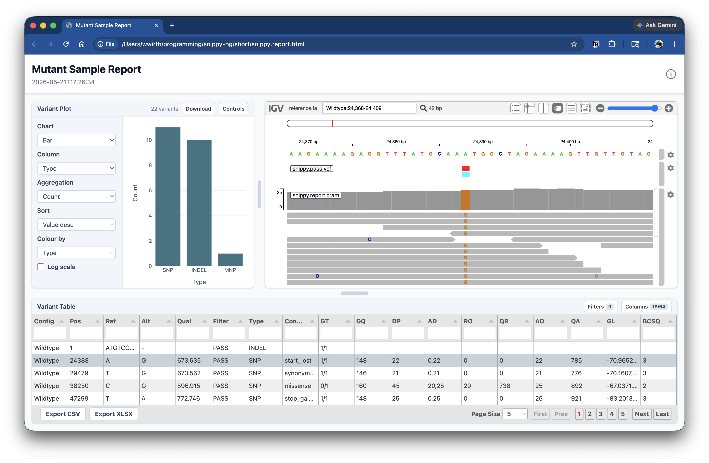

# `snippy-ng utils report sample`

Create a standalone HTML report for a single sample from a VCF, with an optional
embedded alignment view.

The sample report renders an interactive variant table and, when an alignment and
reference are provided, an IGV.js panel showing cropped windows around each
variant. It is useful for inspecting a single Snippy-NG run, sharing per-sample
results, or reviewing variants before downstream interpretation.



## Example report

[Here is an example sample report](sample.html) generated with Snippy-NG.

<iframe
  src="sample.html"
  title="Example Snippy-NG sample report"
  loading="lazy"
  style="width: 100%; min-height: 760px; border: 1px solid var(--md-default-fg-color--lightest); border-radius: 8px;"
></iframe>

## Quick start

Generate a VCF-only sample report:

```console
snippy-ng utils report sample short/snippy.pass.vcf
```

This writes the HTML report to:

```text
report/sample.html
```

If you also provide an alignment, you must provide the matching reference.

```console
snippy-ng utils report sample sample.vcf \
  --alignment sample.cram \
  --reference ref.fa
```

## Inputs

The only required input is a VCF file.

```console
snippy-ng utils report sample sample.vcf
```

To embed an alignment viewer, provide both `--alignment` and `--reference`.

```console
snippy-ng utils report sample sample.vcf \
  --alignment sample.bam \
  --reference ref.fa
```

The alignment can be BAM or CRAM. Snippy-NG extracts windows around each variant
and embeds the cropped alignment in the final report.

## Variant selection

Use `--variant-scope` to choose whether the report includes only PASS variants or
all variants in the input VCF.

```console
snippy-ng utils report sample sample.vcf --variant-scope all
```

Use `--window-size` to control how many bases of context are shown around each
variant when alignment windows are generated.

```console
snippy-ng utils report sample sample.vcf --window-size 500
```

## Output options

By default, the command writes `report/sample-report.html`.

Use `--outdir` to choose the output directory:

```console
snippy-ng utils report sample sample.vcf --outdir results/report
```

Use `--prefix` to choose the output filename prefix:

```console
snippy-ng utils report sample sample.vcf --outdir results/report --prefix mutant
```

This writes:

```text
results/report/mutant.html
```

## Report options

Set a custom report title:

```console
snippy-ng utils report sample sample.vcf --title "Mutant sample report"
```

Override the displayed sample name:

```console
snippy-ng utils report sample sample.vcf --sample-name mutant-01
```

Combine options:

```console
snippy-ng utils report sample sample.vcf \
  --alignment sample.cram \
  --reference ref.fa \
  --variant-scope all \
  --window-size 500 \
  --title "Mutant sample report" \
  --sample-name mutant-01 \
  --outdir sample-report \
  --prefix mutant
```

## Command reference

```text
snippy-ng utils report sample [OPTIONS] VCF
```

| Option | Default | Description |
| --- | --- | --- |
| `VCF` | required | Input VCF file to render. |
| `--alignment`, `--cram`, `--bam` | none | Optional BAM or CRAM alignment to embed after windowing. |
| `--reference`, `--ref` | none | Reference FASTA required when `--alignment` is provided. |
| `--variant-scope` | `pass` | Include only PASS variants or all variants. |
| `--window-size` | `100` | Number of bases of context around each variant. |
| `--title` | `Snippy-NG Sample Report` | Title shown in the HTML report. |
| `--sample-name` | none | Optional sample name override. |
| `--outdir`, `-o` | `report` | Output directory. |
| `--prefix`, `-p` | `sample` | Prefix for the generated HTML file. |